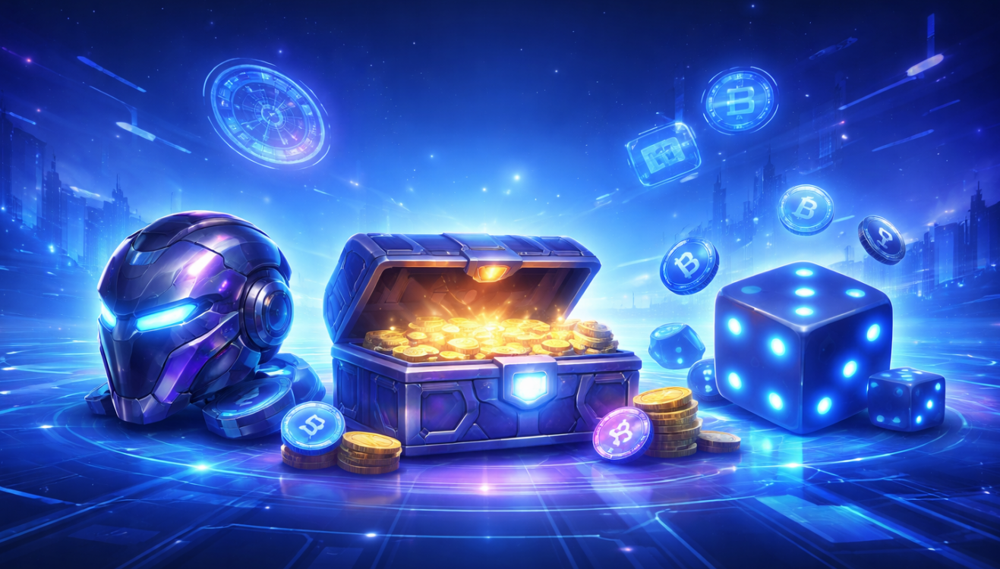

# AmonixPlay

## Decentralized AI-Powered Multi-Chain Gaming Platform
 
> AmonixPlay is a multi-chain gaming platform designed to combine the best of Web3, AI, and blockchain technologies to create a fair, rewarding, and engaging ecosystem for gamers worldwide. AmonixPlay integrates AI-driven game mechanics with Play-to-Earn (P2E) systems, NFT avatars, and a decentralized token economy that rewards players for their skills and achievements.
---



---
## Current Features

- **Multi-Chain Integration**: Seamless interaction across different blockchain networks, offering scalability and interoperability.
- **AI-Powered Gameplay**: Adaptive AI mechanics that assess player skill levels and match them with suitable opponents to ensure fair gameplay.
- **Play-to-Earn (P2E)**: Players can earn cryptocurrency rewards based on in-game performance, creating real-world value from gaming achievements.
- **NFT Avatars**: Unique, customizable avatars that represent in-game personas and hold inherent value.
- **On-Chain Game Logic**: All gameplay is controlled by smart contracts.
- **Token Integration**: Stake and earn with native tokens across different blockchains.
- **Mobile and Desktop Ready**: The platform works on both **desktop** and **mobile** devices.

---

## Coming Soon

- **More Games**: New games like **Blackjack**, **Roulette**, **Slots**, and others. All powered by decentralized AI.
- **Tournaments**: Compete in cross-chain tournaments with prize pools. AI will manage the events and rewards.
- **Social Features**: Chat, add friends, and interact with other players across different blockchains.
- **Better P2E**: Improved reward systems that will work across all blockchains with the help of AI.


[](#)
[](#)
[](#)
[](#)
[](#)
[](#)
[](#)
[](#)


## Quick Start

```bash
git clone <git-repository-url>
cd <Project Directory>

# Install root dependencies
npm install

# Go to the client folder and install its dependencies
cd client
npm install

# Start
npm start
```

---

## Config

- **JWT issuance** – `POST /api/auth` in `controllers/auth.js` signs a JWT with `config.JWT_SECRET_KEY` (see `SESSION_EXPIRES_IN`). The payload only contains `user.id` so you can safely extend it.
- **Client storage** – Tokens are pushed into Axios’ default headers via `client/src/helpers/setAuthToken.js`. Persist them in `localStorage`/`sessionStorage` from your auth screen and call `setAuthToken(token)` on boot.
- **Protected routes** – `middleware/auth.js` expects the token in the `x-auth-token` header and injects `req.user`. Use the middleware on any route that needs authenticated identity.

## Contributing Guidelines

### Pre-PR Checklist

- [ ] Branch is updated with `main`  
- [ ] No linting errors
- [ ] No stray console logs or unused variables  
- [ ] UI changes tested on desktop and mobile  
- [ ] Added documentation or comments where needed  
- [ ] Any new `.env` variables are documented  

### Pull Request Rules
- Use clear PR titles:
  - `feat: add tournament lobby UI`
- PR description must include:
  - What changed  
  - Why it changed  
  - How to test  
  - Screenshots for UI updates  
- Tag related issues/tasks.


