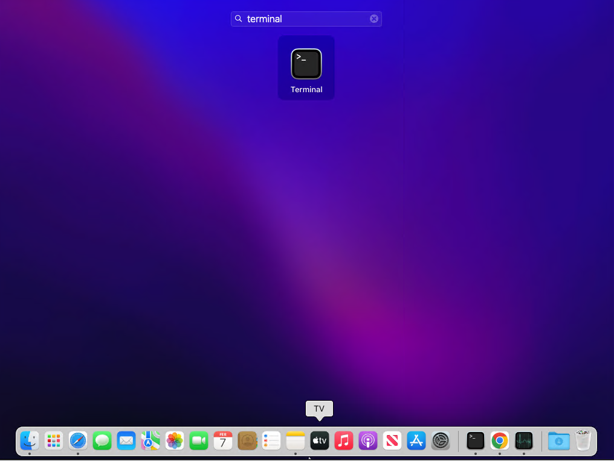
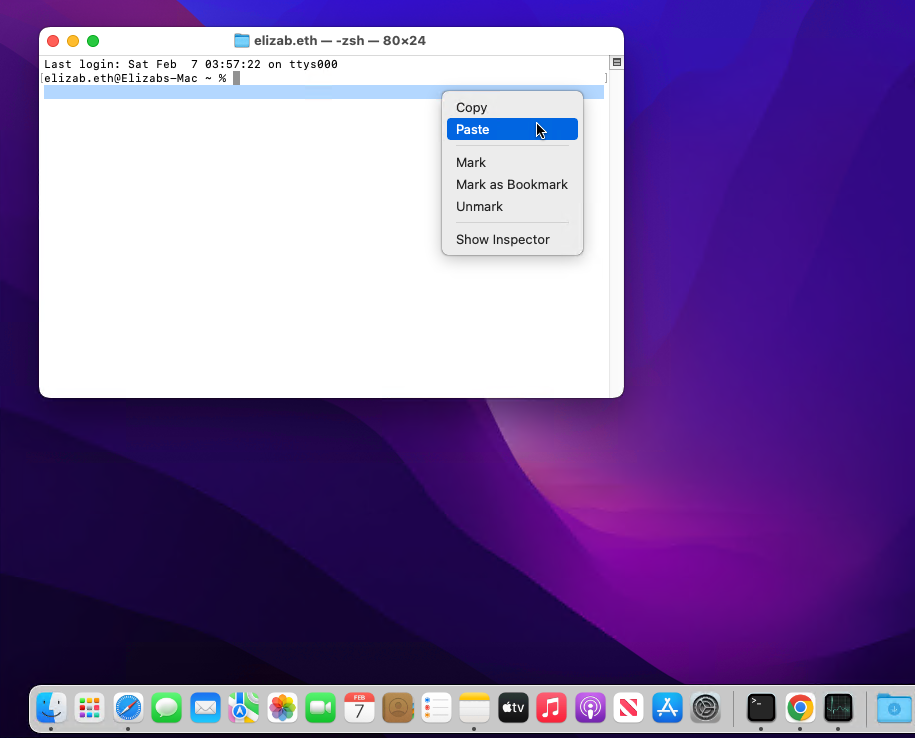
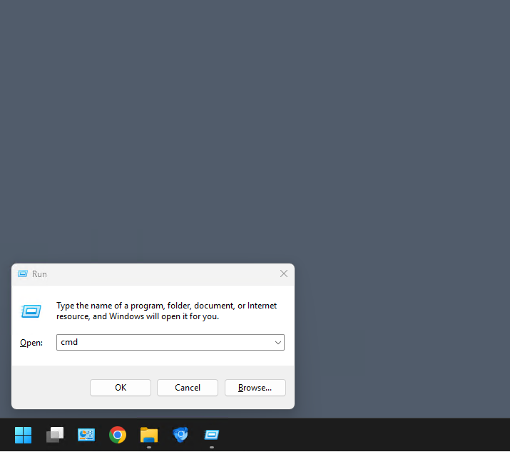
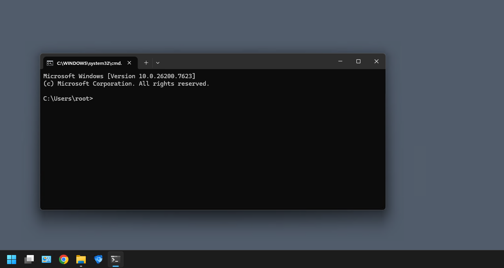

# Decentralized AI Agent Marketplace

**Proof of Concept (PoC)** — A blockchain-based marketplace for publishing, monetizing, and trading autonomous AI agents. No coding needed to run it; pick your system below and follow the 3 steps.

---

## What you'll see

When it's running, open your browser to **http://localhost:5173** and you'll see the app home page:


---

## Mac

**Step 1 — Open a terminal.** Open **Terminal** (search "Terminal" in Spotlight).



**Step 2 — Copy, paste, and run ONE command.** Paste this, then press Enter:

```bash
curl -s https://bitbucket.org/daam2251/ai-agent-marketplace/raw/main/scripts/install.sh | bash
```



The first run may take a few minutes. When you see a message that the app is running, go to Step 3.

**Step 3 — Open the app in your browser.** Go to **http://localhost:5173**. You should see the AI Agent Marketplace home page (as in the first screenshot above).

---

## Windows

**Step 1 — Open a terminal.** Press `Win + R`, type `cmd`, press Enter.



**Step 2 — Copy, paste, and run ONE command.** Paste this, then press Enter:

```cmd
curl -sL https://bitbucket.org/daam2251/ai-agent-marketplace/raw/main/scripts/install-windows.bat -o %TEMP%\install-aim.bat && %TEMP%\install-aim.bat
```



The first run may take a few minutes. When you see a message that the app is running, go to Step 3.

**Step 3 — Open the app in your browser.** Go to **http://localhost:5173**. You should see the AI Agent Marketplace home page (as in the first screenshot above).

---

## Linux

**Step 1 — Open a terminal.** Open your **Terminal** app.

**Step 2 — Copy, paste, and run ONE command.** Paste this, then press Enter:

```bash
curl -s https://bitbucket.org/daam2251/ai-agent-marketplace/raw/main/scripts/install.sh | bash
```

The first run may take a few minutes. When you see a message that the app is running, go to Step 3.

**Step 3 — Open the app in your browser.** Go to **http://localhost:5173**. You should see the AI Agent Marketplace home page (as in the first screenshot above).

---

## How to stop it

- Click in the terminal window where the app is running, then press **Ctrl + C** (Windows/Linux) or **Cmd + C** (Mac).
- Or just close that terminal window.

---

*Technical details: [SETUP.md](SETUP.md)*
